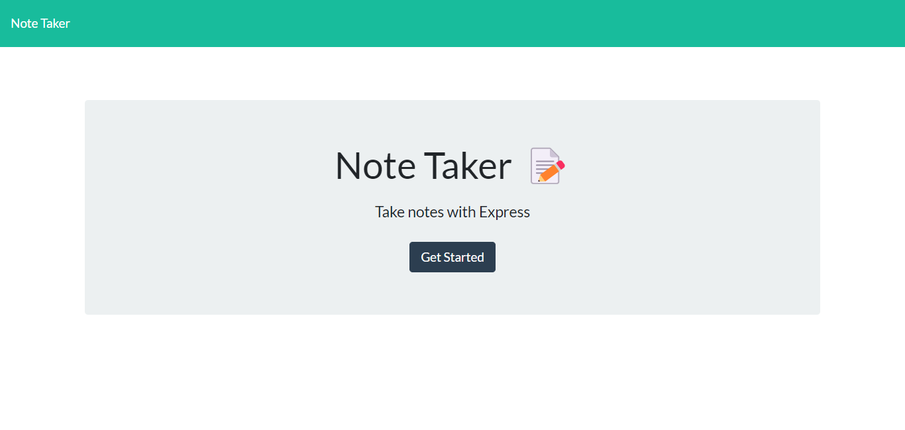
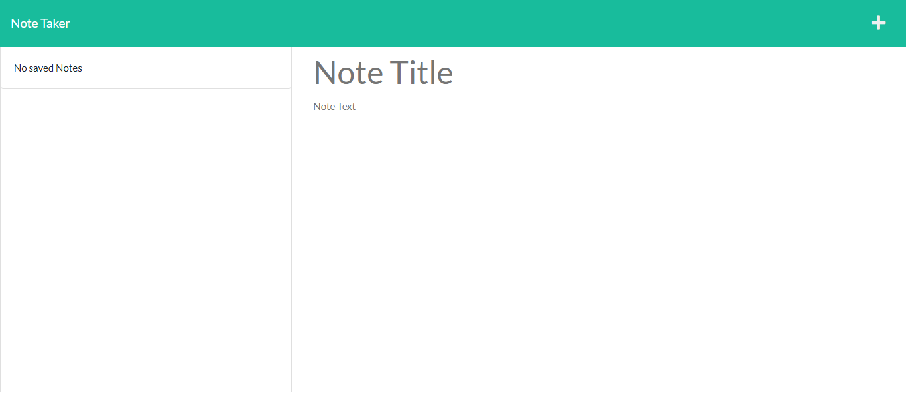

# Note Taker

## Table of Contents:
- [Description](#description)
- [Visuals](#visuals)
- [Technologies](#technologies-used)
- [Usage](#usage)
- [Questions](#questions)
- [Resources](#resources)

## Description
- I created a note taking application that allows you to write, save, and delete notes using express.js as the backend. 
## Visuals

## Technologies used:
- Express.js

## Usage
- This application can be used to write, store and delete notes. The notes must have a Title that goes with them. 
## Questions
Have questions? Feel free to contact me at: 
- [Email](cody.theroux3@gmail.com)
- [Github](https://github.com/codytheroux96)

## Resources
- [Repo](https://github.com/codytheroux96/note-taker)